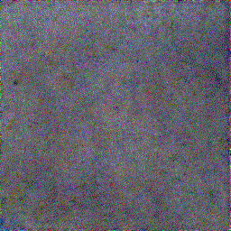

## Inspiration
Our project was inspired by a creative interpretation of the prompt. The traditional digital security model has us hiding our passwords, the key to our digital privacy, behind walls of encryption and in isolation. What if we could build a tool that leverages AI to analyze a password’s strength, generate a secure encrypted image from it, and pit user’s best passwords against each other in a digital artwork contest? Our group’s love of CUDA leveraged AI generation techniques, scratch built web design, digital artwork, and raw competition inspired us to create this unique piece of software.
## What it does
The application we built takes in a password as a text input from the user, and runs a data driven password analytics engine to give the provided password a score between 0-100. This feature allows the user the ability to test their password strength, and ensure that the passwords they sign up to their digital services with are secure. Our application then uses that score to configure and train a guided diffusion image generation algorithm running on pytorch machine learning frameworks to generate a 256x256 image from the users password. This CUDA powered tool has encryption techniques and a small amount of inherent randomness built in to create completely unique images for every submission, these images are then posted to the public gallery, where the password score and (optionally) the user who submitted it are visible to the public, keeping the original password is secure. The digital artworks posted to the gallery can then be voted on by users, with the most liked images rising to the top. This presents a unique opportunity to try and out-password your friends! The complexity of the images rises with the complexity of the provided password, so the more interesting passwords generate more interesting images. Can you make a password creative enough to out-generate your friends? Go ahead and find out!
## How we built it
The web interface was coded from scratch in Node.js, and is hosted locally on a pc using a 3080ti to run the image generation algorithm, which uses a pytorch framework and some ImageNet training data to generate an image based on the provided text. The image is then fed back into our web interface and displayed alongside the number of likes it has and the password strength score displayed underneath it.
## Challenges we ran into
We initially tried hosting our application inside a flask container, but ran into a multitude of issues with the library setup and eventually abandoned it to create our own website from scratch . We also had a lot of trouble getting the machine learning libraries to behave the way we wanted, with the majority of our time was spend debugging and configuring our image generation software to the parameters we wanted.
## Accomplishments that we're proud of
Ultimately we have a working application that leverages some pretty advanced machine learning functionality to create unique digital art and encourage people to step up their password security. We think our project is as creative as they come and are extremely proud of the finished product.
## What we learned
We learned a tremendous amount about front end web design, and pytorch libraries throughout this process, these fields are so deep that there is always more to learn.
## What's next for SecureAI
Our project serves mostly as a proof of concept, there is so much more we could do with this idea, from integrating password managers to provide a collage of your digital logins, to wider social features creating head to head competition scores and public leaderboards. There is always room to improve the finer aspects of the image generation and many many other areas,

# minnehack22
A code repository for projects created during Minnehack 2022 This repository does not include the machine learning libraries, those can be found here:
https://github.com/afiaka87/clip-guided-diffusion

## To run the server use:
```shell
> node server.js
```


